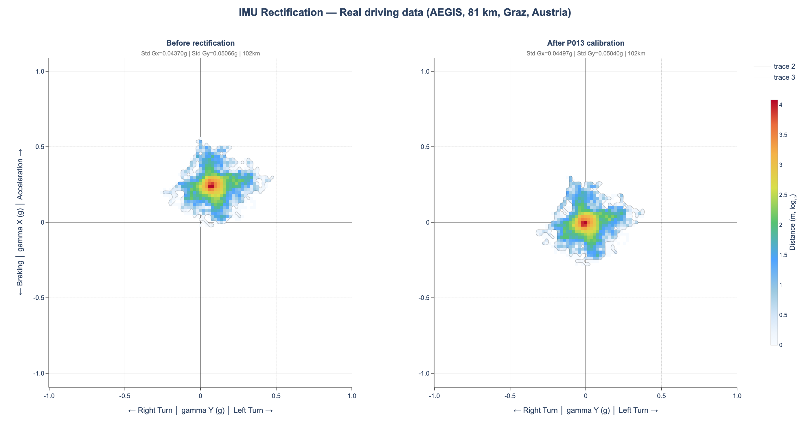

# gg-diagram

**Publication-quality GG diagrams for vehicle dynamics analysis.**

Plot lateral vs longitudinal acceleration as distance-weighted heatmaps. Based on the GG diagram concept from Milliken & Milliken's *Race Car Vehicle Dynamics* (1995).



*Real driving data (AEGIS dataset, 81 km, Graz, Austria). Left: raw IMU signal with gravity bias. Right: after in-field calibration -- the acceleration cloud is centered and aligned with the vehicle axes.*

## Installation

```bash
pip install gg-diagram
```

## Quick Start

```python
import pandas as pd
from gg_diagram import gg_heatmap

df = pd.read_parquet("my_driving_data.parquet")

fig = gg_heatmap(df, ax_col="ax_mps2", ay_col="ay_mps2", speed_col="speed_mps")
fig.show()
```

## Features

- **Distance-weighted heatmap** -- bins weighted by `speed * dt`, not sample count
- **Log scale** -- reveals both high-density core and low-density tails
- **Publication style** -- directional axis labels (Braking/Acceleration, Right/Left Turn), external contour, automotive colorscale
- **Before/After comparison** -- `gg_compare()` with shared color axis
- **Two modes** -- `mode="interactive"` (rich hover) or `mode="paper"` (compact for export)
- **Auto unit detection** -- accepts m/s2, g, or mG
- **Variable frequency** -- computes dt from timestamps (handles multi-rate datasets)

## API

### `gg_heatmap(df, ...)`

Single GG diagram.

```python
fig = gg_heatmap(
    df,
    ax_col="ax_mps2",       # longitudinal acceleration column
    ay_col="ay_mps2",       # lateral acceleration column
    speed_col="speed_mps",  # speed in m/s (for distance weighting)
    ts_col="ts",            # timestamp column (for variable dt)
    hz=10.0,                # fallback frequency if no timestamps
    title="My GG Diagram",
    mode="interactive",     # or "paper"
    output_html="gg.html",  # optional HTML export
)
```

### `gg_compare(df_before, df_after, ...)`

Side-by-side comparison with shared color scale.

```python
fig = gg_compare(
    df_before, df_after,
    title_before="Raw",
    title_after="Calibrated",
    main_title="IMU Rectification",
    mode="paper",
    output_html="compare.html",
)
```

### `gg_scatter(df, ...)`

Scatter plot with optional speed coloring.

```python
fig = gg_scatter(df, color_col="speed_mps")
```

## Metrics

Each figure exposes severity metrics via `fig._gg_meta`:

```python
fig._gg_meta["std_gx"]             # Std of longitudinal acceleration (g)
fig._gg_meta["std_gy"]             # Std of lateral acceleration (g)
fig._gg_meta["total_distance_km"]  # Total distance (km)
```

## Data Format

The package expects a pandas DataFrame with at minimum:

| Column | Unit | Description |
|--------|------|-------------|
| `ax_mps2` | m/s2 | Longitudinal acceleration |
| `ay_mps2` | m/s2 | Lateral acceleration |
| `speed_mps` | m/s | Vehicle speed (for distance weighting) |
| `ts` | datetime | Timestamp (optional, for variable-rate data) |

Column names are configurable via `ax_col`, `ay_col`, `speed_col`, `ts_col`.

## Links

- Research: [research.roadsimulator3.fr](https://research.roadsimulator3.fr)
- Simulator: [simulate.roadsimulator3.fr](https://simulate.roadsimulator3.fr)
- Author: Sebastien Edet

## License

MIT
